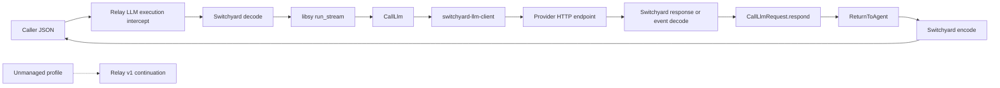

<!--
SPDX-FileCopyrightText: Copyright (c) 2026 NVIDIA CORPORATION & AFFILIATES. All rights reserved.
SPDX-License-Identifier: Apache-2.0
-->

# Switchyard NeMo Relay Dynamic Plugin

This crate builds the external `nvidia.switchyard` native plugin. It embeds
`switchyard-libsy`, drives `Algorithm::run_stream`, and uses
`switchyard-llm-client` for provider HTTP calls. Managed calls use Relay's
public Rust LLM execution-intercept SDK and do not require a targeted provider
continuation from Relay.

The plugin uses NeMo Relay native API v1. It depends on the small
`nemo-relay-plugin` authoring SDK, not the Relay runtime, and does not start
`switchyard-server`. Managed provider calls do not use Relay's provider
continuation.

## Ownership boundary

For a managed LLM call:

1. Relay invokes the native LLM execution intercept.
2. The plugin decodes the caller JSON through `switchyard-translation`.
3. The plugin drives the configured libsy algorithm with `run_stream` and
   records each genuine decision.
4. For every `CallLlm`, the plugin's `switchyard-llm-client` instance translates
   the neutral request, applies the selected target's URL and credentials, and
   performs the HTTP request.
5. The plugin passes the real buffered response or response stream to
   `CallLlmRequest::respond` and continues until `ReturnToAgent`.
6. The plugin encodes the final neutral response into the caller's protocol.

Relay still owns the outer LLM lifecycle, dynamic-plugin loading, plugin
configuration, and event substrate. Relay's downstream LLM continuation is
used only for calls whose inbound protocol is not managed by this plugin.



This boundary has two important consequences:

- Managed provider calls do not traverse Relay middleware registered after the
  Switchyard intercept and do not use the host's provider callback. Provider
  transport activity is therefore not represented as nested Relay LLM
  lifecycle events. Relay records the outer managed call and the plugin emits
  Switchyard routing marks; bridging Switchyard transport spans into Relay is
  future work. Routing marks are delivered through the public SDK while Relay
  is polling the active execution callback or stream, so they remain attached
  to the current Relay scope stack.
- Switchyard owns provider URLs, credentials, HTTP retry behavior, and
  translation for managed calls. Relay neither validates nor transports those
  target details.

## Native API v1 and the public Rust SDK

The manifest uses `compat.native_api = "1"`. The implementation registers with
`PluginContext::register_llm_execution_intercept` and
`PluginContext::register_llm_stream_execution_intercept`, receives typed
`LlmRequest`, `LlmNext`, and `LlmStreamNext` values, and returns the SDK's JSON
result or `LlmJsonStream`. The `nemo-relay-plugin` SDK owns the C callback
trampolines, host strings, continuation handles, panic containment, and native
stream lifecycle. Switchyard contains no raw C callback or host-table adapter.

Switchyard performs libsy and provider I/O on a plugin-owned Tokio runtime. A
buffered SDK callback waits for that executor to finish. A managed streaming
callback returns a pull-based Rust iterator backed by a bounded 32-message
channel; the async producer waits when the consumer is slow. Dropping that
iterator closes the channel and aborts its in-flight routing task.

The public native API v1 callback shapes do not provide full in-flight caller
cancellation. A buffered callback has no cancellation token, so a provider
request already in progress continues until it responds or reaches the client
timeout after the caller disconnects. Relay can cancel a streaming iterator
between pulls, but its synchronous `Iterator::next` call cannot be interrupted
while it is waiting for the next provider event. Supporting prompt disconnect
propagation would require an asynchronous public SDK callback or stream-polling
contract; the plugin does not bypass the SDK to recover that behavior.

### Relay runtime capacity

In Relay 0.7, the safe native LLM callbacks run directly in Relay's asynchronous
middleware future; Relay does not move them to Tokio's separate blocking pool.
Consequently, each active buffered Switchyard call occupies a normal Relay
Tokio worker while it waits for the plugin executor, and a streaming call
occupies a worker while its synchronous `Iterator::next` waits for the next
provider event. Exhausting those workers can delay unrelated Relay work.

The Relay CLI constructs a Tokio multi-thread runtime without setting an
explicit worker count. Tokio therefore defaults to the number of CPU cores
available to the process and honors its `TOKIO_WORKER_THREADS` environment
variable. Operators can provide additional capacity while using this native API
v1 integration, for example:

```bash
TOKIO_WORKER_THREADS=32 nemo-relay ...
```

This adjusts the normal asynchronous worker pool, not Tokio's blocking pool;
increasing `max_blocking_threads` does not address this integration. There is no
universal recommended value. Size the pool with headroom above the expected
number of concurrent managed calls and Relay's other work, then validate it
under representative provider latency and streaming concurrency. Increasing
the worker count mitigates starvation but does not restore cancellation or make
the synchronous boundary non-blocking.

Embedded Relay hosts own their Tokio runtime and should configure the same
capacity explicitly:

```rust
let runtime = tokio::runtime::Builder::new_multi_thread()
    .worker_threads(32)
    .enable_all()
    .build()?;
```

The durable resolution is a public Relay SDK callback and stream-polling
contract that can yield while provider I/O is pending and receive caller
cancellation. Until that exists, provision worker capacity and load-test the
intended concurrency rather than relying on thread-pool growth alone.

Unmanaged profiles call the typed `LlmNext` or `LlmStreamNext` continuation and
return its result directly. Managed streams use the bounded Switchyard channel;
unmanaged streams use Relay's SDK-owned pull iterator without an additional
bridge. None of the managed HTTP or routing operations requires a targeted LLM
continuation or direct access to Relay's C ABI.

## Supported routers

This initial plugin supports exactly two libsy algorithms:

- seeded, weighted `random` routing; and
- capability-based `llm_classifier` routing, where a judge selects the weak or
  strong target before the final provider call.

`stage_router` and response-judging escalation are intentionally deferred.
Unsupported algorithm kinds are rejected instead of being approximated.

The plugin owns the outer routing retry loop. Each retry starts a fresh libsy
run. Random routing draws again; an algorithm configured with persistent state,
such as classifier session affinity, may intentionally retain its assignment.
Each target's built-in HTTP retry count is set to zero to avoid retrying a
failed target invisibly before reselection. A random target with `weight = 0`
is fallback-only and is not considered by the algorithm. Trusted fallback is
attempted at most once and, for streaming responses, only before the first
caller event is emitted. Outer routing retries use exponential backoff starting
at 250 milliseconds and capped at 2 seconds. They do not currently honor
provider `Retry-After` headers because the client error contract does not expose
that metadata to the routing loop.

## Translation and stream fidelity

`switchyard-translation` is the only request, response, and event translation
layer. It decodes caller JSON into Switchyard's neutral protocol, encodes each
selected call for the target protocol, decodes provider results, and encodes
`ReturnToAgent` back to the caller protocol. Relay codecs are not used.

The streaming contract carries each parsed provider JSON event in a preservation
envelope alongside its normalized `LlmResponseChunk` representation.
Same-protocol routes replay the preserved JSON unchanged, including
provider-specific fields; this preserves parsed events, not raw SSE bytes or
framing. Cross-protocol routes encode only normalized chunks, and the streaming
helpers still do not expose the buffered translation engine's reject-lossy
diagnostics, so unsupported fields may be normalized or omitted. Replacing
normalized stream content or folding a stream into an aggregate drops the
per-event preservation envelope.

## Configuration

During release-candidate validation the manifest declares
`compat.native_api = "1"` and Relay `>=0.7.0-rc.4,<1.0`, and the Rust SDK uses
the exact published `0.7.0-rc.4` crate. Before release, move both lower bounds
to stable `0.7.0`. The manifest API value selects Relay's released native
plugin contract; plugin authors use its safe Rust SDK rather than the underlying
C table directly. Rebuild the bundle when changing SDK versions rather than
assuming Rust dynamic-library compatibility from the manifest value alone.

A Relay project can configure a seeded weighted-random router as follows:

```toml
version = 1

[[plugins.dynamic]]
manifest = "/opt/switchyard-relay-plugin/relay-plugin.toml"

[plugins.dynamic.config]
version = 2
priority = 0
max_retries = 3

[plugins.dynamic.config.algorithm]
kind = "random"
seed = 42

[plugins.dynamic.config.default_targets]
openai_chat = "fast"

[plugins.dynamic.config.targets.fast]
model = "provider/model"
protocol = "openai_chat"
endpoint = "/v1/chat/completions"
base_url = "https://provider.example.com"
weight = 1

[plugins.dynamic.config.targets.fast.header_env]
authorization = "PROVIDER_AUTHORIZATION"
```

Target map keys such as `fast` are stable semantic names visible to libsy. The
target binding is authoritative for the provider model, protocol, endpoint,
base URL, weight, and headers. Each `default_targets` key both enables that
inbound protocol and names its trusted fallback.

`header_env` resolves target credentials in the plugin process at registration
time. Environment values must not appear in configuration, errors, routing
marks, spans, or debug output. The plugin does not inherit caller credentials
for managed calls. Each variable supplies the complete header value, so an
`authorization` value must include its scheme, such as `Bearer`.
Common credential headers, including `authorization` and `x-api-key`, are
rejected in static `headers` and must use `header_env`. Static headers remain
appropriate for non-secret routing or tenancy metadata.

For `kind = "llm_classifier"`, the classifier target must use `openai_chat` or
`openai_responses`; libsy's judge request uses a JSON-schema response format
that cannot be represented losslessly by Anthropic Messages. The remaining
classifier fields map directly to libsy's capability classifier configuration.

Version-1 service configuration, decision-only execution, and observe-only
mode are rejected.

## Build and bundle

The crate is a source/build unit with `publish = false`. Operators install a
binary bundle rather than a Rust crate:

```bash
cargo build --release -p switchyard-nemo-relay-plugin
python3 crates/switchyard-nemo-relay-plugin/scripts/package_bundle.py \
  --library target/release/libswitchyard_nemo_relay_plugin.so \
  --output dist/switchyard-nemo-relay-plugin-linux-x86_64
```

On macOS the library suffix is `.dylib`; Windows builds use `.dll`. The bundle
builder creates the minimal Relay package: the shared library, a materialized
manifest with Relay's inline SHA-256 integrity digest, and the JSON schema.

Install the materialized bundle with Relay's normal lifecycle commands:

```bash
nemo-relay plugins validate /opt/switchyard-relay-plugin/relay-plugin.toml
nemo-relay plugins add /opt/switchyard-relay-plugin/relay-plugin.toml
nemo-relay plugins enable nvidia.switchyard
nemo-relay plugins inspect nvidia.switchyard
```

## Validation expectations

Before release, validate both routers against buffered and streaming OpenAI
Chat, OpenAI Responses, and Anthropic Messages providers. The acceptance suite
must cover same- and supported cross-protocol routes, deterministic weighted
routing, independent runs, classifier weak and strong selections, retry
reselection, exhaustion, exactly-once fallback, stream commitment, empty
streams, late errors, cancellation, credential privacy, and unmanaged
pass-through.

The tests must also prove that managed target traffic reaches the provider
through `switchyard-llm-client`, never through Relay's provider continuation,
and that no Switchyard service or health endpoint is involved.
