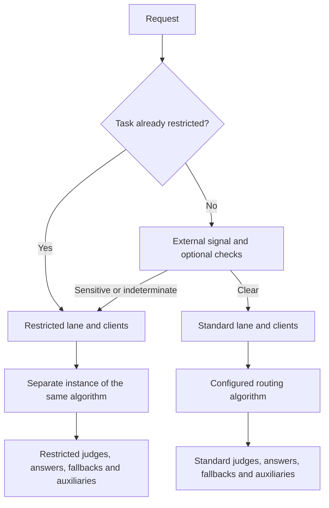

# Privacy routing spike

This spike lets an application restrict the models Switchyard may call while keeping its
existing routing algorithm. Libsy checks the allowed model IDs. Runner chooses the matching
clients, judges, fallbacks, and auxiliary targets.

External restriction works without built-in detection. Deterministic and semantic checks are
optional. Whether Switchyard should maintain privacy categories and detector prompts remains
a team decision. This branch demonstrates the implementation; it is not a released API.

## Responsibilities

| Component | Responsibility |
|---|---|
| Embedded application | Supply an external restriction and trusted task identity, if needed. |
| Libsy | Check declared targets; build and validate optional semantic judge calls. |
| Runner | Choose the lane, its clients and auxiliaries; apply thresholds and task retention. |
| LLM client | Execute provider requests, retries, and candidate fallbacks. |

The semantic adapter reuses libsy's private structured judge contract, request builder, decoder,
and `Driver`. It does not expose those private helpers or replace the existing router.



## External classification only

These examples assume the named targets are declared in the deployment. The host decides
whether a request needs restricted targets. No detector or classifier runs in this example.

```toml
[routes.coding]
id = "switchyard/coding"
type = "stage_router"
efficient_target = "fast"
capable_target = "capable"
picker = "efficient_first"
confidence_threshold = 0.60

[routes.coding.privacy]
accept_external_signal = true

[routes.coding.privacy.restricted_targets]
fast = "private_fast"
capable = "private_capable"
```

```rust
use switchyard_runner::mark_privacy_restricted;

if requires_restricted_targets {
    mark_privacy_restricted(&mut request);
}
let output = route.execute(request, None).await?;
```

This is a trusted in-process signal, not an HTTP header. A marked request fails if the route
has not enabled external signals. An unmarked request can still be restricted by other checks.

## Always-private workload

Use an ordinary route containing only approved targets. It does not need classification or a
second lane. Stage still makes its normal efficient/capable choice.

```toml
[routes.private_coding]
id = "switchyard/private-coding"
type = "stage_router"
efficient_target = "private_fast"
capable_target = "private_capable"
picker = "efficient_first"
confidence_threshold = 0.60
```

## Optional semantic assessment

Add one classifier to the mixed route. A generic LLM target and a typed decision target are
alternatives, not consecutive judges. The classifier endpoint must be approved for all content
entering the route because it sees that content before lane selection.

```toml
[routes.coding.privacy.classifier]
type = "llm"
target = "privacy_classifier" # An entry in targets.
clear_threshold = 0.90
response_format_type = "json_schema"
# prompt = "Your policy instructions."
```

```toml
[routes.coding.privacy.classifier]
type = "decision"
target = "privacy_decision" # An entry in decision_targets.
clear_threshold = 0.90
# instructions = { policy = "Your policy instructions." }
```

The generic path supports `json_schema` and `json_object`, with typed local verdict validation.
Both include the schema in the prompt. The input borrows content-bearing request fields,
including instructions, tools, extensions and preserved request bodies; it excludes transport
metadata and cached responses. The serialized input is bounded to 64 KiB. Invalid output,
oversized input, uncertainty, low clear scores and failed calls restrict the current request.
`clear_score` is a model score, not a calibrated guarantee of safety.

Deterministic checks can also be enabled explicitly with
`[routes.coding.privacy.deterministic]` and `detectors = ["email", "api_key"]`.

## Task retention

Set `restriction_scope = "task"` in the existing privacy table and supply
`request.metadata.task_id`. Only explicit external restriction, a deterministic match, or a
valid sensitive semantic verdict becomes sticky. A failure, invalid verdict, uncertainty or
low clear score is reassessed next turn.

Retention is process-local and limited to 4,096 restricted task IDs. There is no expiry, reset
API or replica coordination. Missing/invalid task IDs and exhausted capacity restrict requests.

## Boundaries and API impact

Direct Rust hosts can use `RuntimeModels::with_target_restriction()` and a matching
`ClientRouter`. The guard covers `Driver`, the default `run_stream`, and `drive`, including
rewritten steps from a custom stream. A custom stream consumer must enforce its own boundary.
Model IDs do not distinguish deployments exposing the same model: the host must select the
correct clients. This does not sandbox arbitrary Rust code or network calls made by the host.

The additive prototype APIs are `PrivacyPreflight`, `PrivacyAssessment`, and the restriction
builder. Existing public signatures and the native plugin ABI are unchanged. No new crate
dependency is added. Generic judge helpers remain private.

Map every callable target in a mixed route, including judges and fallbacks. A typed routing
judge also needs `restricted_decision_target`. Mixed routes currently reject forwarded caller
auth, prefill routing, and OpenAI Responses continuation state. Direct embedded hosts must not
reuse a broad client router's stored continuation across privacy lanes.

This iteration leaves the TOML unchanged. A `privacy = true` flag could mean source opt-in,
an always-restricted route, or target approval. Those are different decisions; this spike does
not combine them.

## Validation

Tests cover target enforcement, custom stream overrides, bounded context, malformed verdicts,
thresholds, task retention and cancellation. The loopback HTTP proof covers both JSON modes,
same-model deployments, fallback, and 32 runner executions. Synthetic verdicts validate wiring,
not detector accuracy. No live provider benchmark was rerun for this iteration.

Classifier calls now use the standard libsy call spans and metrics. The INFO context span keeps
route attribution; Relay privacy decision marks are unchanged. Buffered response IDs/models
remain available. Abandoned calls use the existing `error` outcome rather than a separate
`cancelled` label. Custom prompts follow the shared contract, which rejects
`{{RESPONSE_SCHEMA}}` placeholders because Switchyard supplies the schema.
