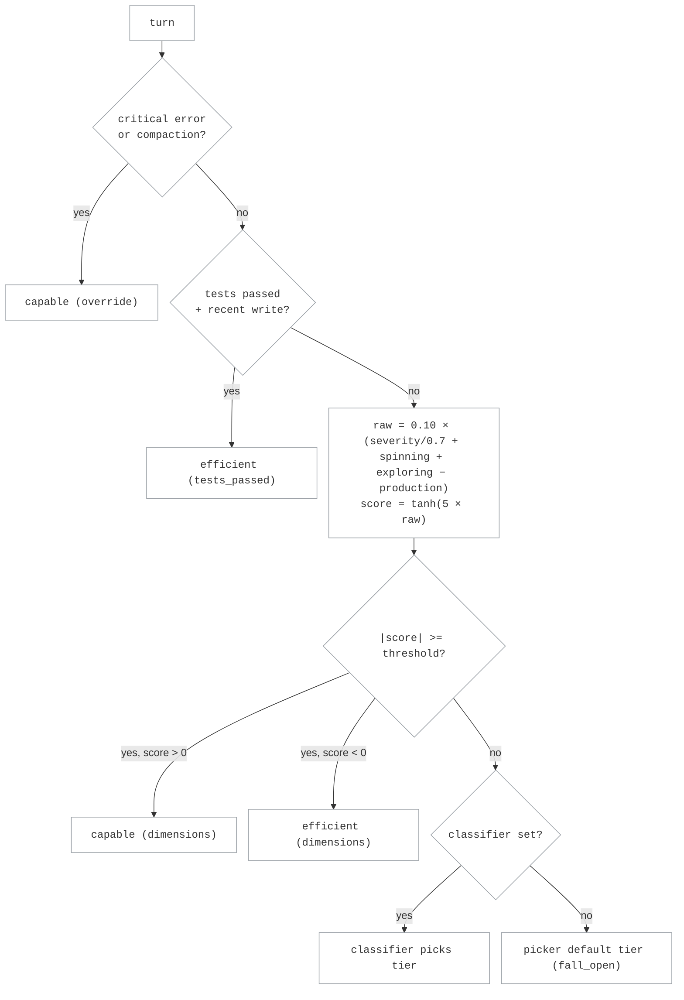

# Stage-Router Routing

Stage-router routing sends each request to either a **capable** model or a
cheaper **efficient** one, depending on where the agent is in its run. The goal
is to spend the capable model on the turns that need it (exploration, error
recovery, hard reasoning) and let the efficient model carry the routine,
mechanical work. Which tier a turn defaults to depends on the picker you choose
(`capable_first` or `efficient_first`); the signals then move individual turns
off that default. Two knobs shape that behaviour — `confidence_threshold` (how
much evidence it takes to leave the default tier) and `recent_turn_window` (how
much history the signals see) — plus an optional LLM classifier.

If the selected target exceeds its context window, the router tries the next
eligible target until one succeeds or all configured targets have been tried. See
[Context-Window Handling](../operations/context_window.md).

## How it works

A coding agent's run moves through stages: early on it explores the codebase and
recovers from errors, and later it settles into more mechanical implementation.
Those stages call for different amounts of model capability, which is what the
router keys on.

For each LLM call, stage-router estimates which stage the agent is in from the
**tool-result history** on the conversation, scoring two axes:

- **WRONG → capable**: `severity` (windowed error severity), `spinning` (deep
  churn with no reads or writes), and `exploring` (reading or planning without
  producing) push toward the capable tier.
- **PROGRESS → efficient**: `recent_production_intensity` (writes and edits
  landing over the recent window) pushes toward the efficient tier.

### How the score is computed

The four signals are summed on one axis — error evidence minus production
evidence — then squashed:

```text
raw   = 0.10 × ( severity / 0.7  +  spinning  +  exploring  −  production_intensity )
score = tanh( 5.0 × raw )                                    → [-1, +1]
```

Each maxed signal contributes one unit of `0.10`, so no single axis can peg the
score on its own. The `tanh` keeps the result bounded and makes the axes
**corroborative** — agreement between signals is what moves the score decisively:

| Maxed signals agreeing | `raw` | `score` |
|---|---|---|
| 1 | `0.10` | `±0.462` |
| 1.5 | `0.15` | `±0.635` |
| 2 | `0.20` | `±0.762` |
| 3 (all error signals) | `0.30` | `±0.905` |

**Sign is direction, magnitude is confidence.** A positive score points at the
capable tier, negative at the efficient tier, and `confidence = |score|`.

Two hard rules run *before* the scorer and ignore the threshold entirely: a
critical-error severity (or a context compaction) forces capable, and a settled
turn — tests passed, a recent write, no windowed error — forces efficient.

The routing decision for one turn:



A turn with no tool-result history yet has no stage to estimate, so it takes the
default tier.

## Pickers

The picker name says which tier is the **default**: the tier used when the
signals are ambiguous and no classifier verdict is available.

- **`capable_first`**: capable is the default; drop to efficient only when the
  signals (or the classifier) clearly say so. Quality-first.
- **`efficient_first`**: efficient is the default; escalate to capable only when
  the signals (or the classifier) clearly say so. Cost-first.

Both pickers read the same signals; only the default tier differs.

## Tuning `confidence_threshold`

Scores live on `[-1, +1]`. The threshold `t` carves that line into three bands,
and the picker decides who owns the middle one.

**`efficient_first`** — the middle band falls to efficient:

```text
        efficient                              │   capable
  ├───────────────────────────────────────────┼───────────┤
 -1                                            t          +1
        (confident efficient + fall_open)      │ (confident escalation)
```

**`capable_first`** — the middle band falls to capable:

```text
   efficient  │                    capable
  ├───────────┼───────────────────────────────────────────┤
 -1          -t                                           +1
 (confident   │      (fall_open + confident capable)
  drop)       │
```

So for `efficient_first`, `[-1, t)` routes efficient and `[t, +1]` routes
capable. For `capable_first`, `[-1, -t]` routes efficient and `(-t, +1]` routes
capable. Both pickers read the same scores; only the ownership of the
low-confidence middle differs. (With a classifier configured, the middle band
goes to the classifier instead of straight to the default tier.)

Because the score is `tanh(5 × raw)`, the threshold translates directly into
"how many maxed signals must agree":

| `t` | Maxed signals needed to leave the default tier |
|---|---|
| `0.2` | `0.41` — a fraction of one signal |
| `0.3` | `0.62` — most of one signal |
| `0.5` | `1.10` — one signal plus corroboration |
| `0.7` | `1.73` — nearly two signals |

Raising `t` widens the middle band, so more turns sit on the default tier;
lowering it narrows the band and lets weaker evidence move a turn. Critical-error
overrides fire regardless of `t`.

**Start at `0.3` and sweep.** `confidence_threshold` is required by the TOML
schema. `0.3` is a good opening value because it leaves the band narrow enough
that real signals move turns, which gives a sweep something to measure. Do not
treat any single number as portable: **swap either model and the trajectories
change shape**, so the score distribution moves and the same `t` buys a different
routing split. Recalibrate whenever the tier pair changes.

### Calibrating the threshold from run data

Calibration is a sweep against your own score distribution, not a lookup. Our
published values were calibrated on Terminal-Bench 2.1 and, more recently,
SWE-Bench Pro — which is exactly why you should re-derive them for your task set
and tier pair rather than adopting them.

**1. Get a run to replay.** Any completed run with real tool traffic works; you
do not need a matched capable/efficient pair to pick a threshold. A few dozen
tasks is enough, because every turn in every task is a scored sample.

**2. Replay it through the real scorer.** `benchmark/score_staged_run.py` (the
`switchyard-stage-router-scorer` skill) runs the actual Rust scorer and picker,
so you get the decisions the router would really have made — not a
counterfactual:

```bash
uv run python benchmark/score_staged_run.py --run benchmark/tb_runs/<your_run> \
    --threshold 0.3 --window 3
# → /tmp/<run>-scores.jsonl   (per turn: score, confidence, pick_cf, pick_ef)
# → /tmp/<run>-per-task.csv   (per task: routing split, mean score/confidence)
```

**3. Look at the score distribution before picking `t`.** Histogram the `score`
column from the JSONL. The threshold is a cut line on that histogram, so where
the mass sits tells you what any given `t` will buy:

```text
  turns
    │            ▁▃▅█▅▃▁                     ← most turns cluster near 0
    │        ▁▂▄██████▄▂▁                      (ambiguous, fall_open)
    │    ▁▂▄████████████▄▂▁
    └────┴────┴────┴────┴────┴────┴────┴──
        -1   -0.5   0   +0.5  +1
                     ↑t=0.3  ↑t=0.5
              wider band ──┘  └── narrower escalation path
```

**4. Sweep and read the split off the CSV.** Re-run at several `t` values and
compare the routing split against what you want. If you have both capable and
efficient outcomes for the same tasks, check that escalations land on the tasks
the efficient tier actually fails — the point is to escalate where it changes the
result, not to hit a target percentage.

**Tuning the signal window.** `recent_turn_window` sets how many trailing tool
results the signals are computed over, and it moves the distribution as much as
`t` does. A short window (`3`) reacts fast — a couple of bad results escalate
quickly, and the router drops back just as fast once work resumes. A longer
window (`5`+) smooths over isolated failures and needs sustained trouble to
escalate, which cuts flapping at the cost of reacting late. Sweep it alongside
`t`; they are not independent.

**Caveat on efficient outcomes.** In stage-router the efficient model inherits
conversation history up to the escalation point, whereas a pure-efficient run
starts fresh. So efficient performs at least as well inside stage-router as it
does alone, and any comparison against a standalone efficient run is a
conservative lower bound.

## Route configuration

A working two-provider config — the shape we benchmark with. The capable tier
speaks Anthropic Messages and the efficient tier speaks OpenAI Chat Completions;
the router translates between them per turn.

```toml
schema_version = 1

[llm_clients.anthropic]
format = "anthropic_messages"
base_url = "https://api.anthropic.com"
api_key_env = "ANTHROPIC_API_KEY"

[llm_clients.efficient_provider]
format = "openai_chat"
base_url = "https://your-efficient-endpoint/v1"
api_key_env = "EFFICIENT_API_KEY"

[targets.capable]
id = "claude-opus-4-5"
llm_client = "anthropic"

# Per-target extra_body is merged into the outbound request. Use it to pin
# provider-specific options, e.g. reasoning effort on the capable tier.
[targets.capable.extra_body.output_config]
effort = "medium"

[targets.efficient]
id = "your-efficient-model"
llm_client = "efficient_provider"

[routes.stage]
id = "switchyard"
type = "stage_router"
capable_target = "capable"
efficient_target = "efficient"
picker = "efficient_first"
confidence_threshold = 0.3      # calibrate for your tier pair — see above
recent_turn_window = 3          # optional, defaults to 3

[routes.stage.handoff_notes]
escalation_note = "[router-guidance] A weaker model was handling this task and showed signs of stalling, looping, or repeated errors on the preceding steps, so control was escalated to you, a stronger model. Re-examine the current state directly and do not simply repeat the previous approach."
only_on_wrong_signal_escalation = true
```

Save as `routes.toml` and start the server:

```bash
switchyard-server --config routes.toml --port 4000
```

Add `--routing-log-file /var/lib/switchyard/routing_requests.jsonl` to record
per-request routing decisions for later analysis.

Keep the route `id` aligned with whatever model alias your agent sends — that
string is what selects this route.

This is the recommended default: routing on tool signals alone, no classifier.

### Optional: handoff notes

Add a `[routes.stage.handoff_notes]` section to pass a contextual note to the
model the router switches to. The escalation note is sent to the capable tier on
a signal-driven escalation; the de-escalation note is sent back to the efficient
tier when a settled signal drops the turn there.

```toml
[routes.stage.handoff_notes]
escalation_note = "the previous model was stalling; pick up the diagnosis"
# deescalation_note = "..."          # optional
# only_on_wrong_signal_escalation = true  # default; set false to always send
```

### Optional: per-tier system prompts

```toml
[routes.stage]
# ...
capable_system_prompt = "diagnose before you edit"
efficient_system_prompt = "follow the settled plan"
```

### Optional: LLM classifier fallback

By default the router uses tool signals only. To break ties on low-confidence
turns with a model call, add a `[routes.stage.classifier]` block and set
`confidence_threshold` above `0.0`. The classifier is consulted only for turns
that fall below the threshold:

```toml
[routes.stage.classifier]
target = "strong"          # target the judge is called through (not a routing destination)
base_threshold = 0.5       # p_solve floor to route efficient; below this → capable
min_confidence = 0.7       # judge confidence floor; below this → abstain
recent_turn_window = 3     # conversation span the judge sees
prompt = "Estimate whether the efficient target can complete this request."
```

`prompt` replaces the packaged capability-classifier prompt. Add
`{{RESPONSE_SCHEMA}}` where the active capability schema should appear in the
prompt. The verdict schema and routing thresholds remain unchanged.

Give the classifier its own LLM client or quota bucket where possible. Sharing
one provider bucket with the efficient tier adds a request per classified turn
and can cause sustained 429s at scale.

## Observability

Each response carries two routing headers:

| Header | Content |
|---|---|
| `x-model-router-selected-model` | The model ID the turn was routed to. |
| `x-model-router-rationale` | Human-readable routing reason (e.g. `stage_router selected weak (confidence 0.612)`). |

### Decision sources

The router records an internal `decision_source` for each turn to distinguish the
paths through its cascade:

| Source | When |
|---|---|
| `override` | A critical-error severity (or a context-compaction marker) forced the capable tier. |
| `tests_passed` | A settled run — a recent test pass with a recent write and no windowed error — landed the turn on the efficient tier. |
| `dimensions` | The corroborative scorer crossed `confidence_threshold` and picked the tier by the sign of the score. |
| `llm-classifier` | The signals were ambiguous and the classifier returned a verdict. |
| `fall_open` | The signals were ambiguous and the classifier failed or wasn't configured; the default tier was used. |

## When *not* to use stage-router

- **Single-model deployments.** Use a `passthrough` route instead.
- **Probabilistic A/B splits.** Use
  [Random Routing](random_routing.md) (`type = "random"`).
  The stage-router's signals are wasted on a fixed traffic ratio.
- **No tool-result history.** Stage-router needs meaningful tool-call traffic to
  populate the tool-result signal. For pure chat-completion workloads every
  ambiguous request lands on the picker's default tier.

## Related

- [Architecture](../architecture.md): the end-to-end request lifecycle and
  system boundaries.
